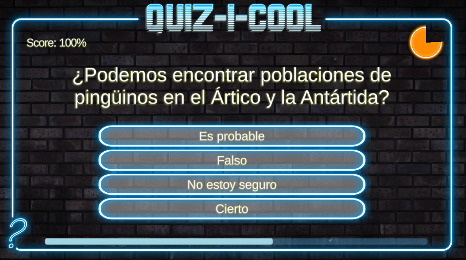

# Quiz Master

> Creado el 30-08-2022

> [DaFont - Descargar fuentes](https://www.dafont.com/es/)

## Contenido

### UI

- Configuración de TextMeshPro
- Adición de botones
- Sliders
- Imágenes

### Código

- Almacenar datos en un objeto Scripter
- Almacenar estos datos en listas, matrices e iterarlos en bucles for
- Recargar la escena cuando se llega al final del juego
- Temporizador radial
- Slider de progreso
- Contador de Puntuación

## UI Canvas

Para añadir un canvas hacer clic derecho en la jerarquía → `UI` → `Canvas`. Se nos añadirá un GameObject `Canvas` y otro `EventSystem` (no eliminar el segundo).

Para insertar un fondo al canvas (una imagen) hacemos clic derecho en el canvas → `UI` → `Image`.

> Todos los elementos de UI siempre deben estar dentro del Canvas.

Haciendo **doble clic sobre el canvas en la jerarquía podemos centrar la vista al canvas completo**, pero hay una peculiaridad. En la esquina inferior izquierda hay un cuadro más pequeño. Este cuadro pertenece a la cámara, y es que hay tres espacios que debemos entender:

- El espacio global donde insertamos GameObjects y donde figura el canvas y demás objetos (el editor de escena en donde trabajamos).
- El espacio del canvas en donde todos los elementos del canvas se acomodan a las dimensiones de la pantalla.
- El espacio de la cámara donde el resto de GameObjects aparecen.

En pocas palabras, la cámara principal del juego y el canvas son dos cosas distintas que no tienen nada que ver la una de la otra, pero que sin embargo ocupan el mismo espacio que la pantalla. Aunque **el canvas siempre aparecerá al frente de la cámara principal**.

Por último, todos los canvas dentro del componente `Canvas` hay una opción llamada `Soft Order` por si tenemos más de un canvas con este valor **podemos ajustar cuáles se verán encima de otras**.

> Podemos tener más de un Canvas dentro de nuestra escena y sería una buena práctica separar los canvas según su propósito y su contexto.

## Position

No podemos editar las propiedades del Canvas porque aquello ocupará siempre todo el alto y ancho de la pantalla. Pero cuando añadimos un hijo, podemos editar la posición y dimensiones del hijo con respecto al Canvas.

Dentro de `Rect Transform` podemos ajustar la posición, el alto y ancho de la imagen (o cualquier otro elemento del canvas).

`Anchors` y `Pivot` es la posición manual por si queremos editarlo desde el código. Como normalmente se hace manualmente es mas práctico hacer clic izquierdo en la imagen del cuadrado de colores que aparece en la esquina superior izquierda. Se nos abrirá un menú con muchos cuadraditos que podemos hacer clic en ellos.

Si pulsamos la tecla `Shift` podemos cambiar de lugar el pivote (que Unity representa como una X) y el pivote es básicamente el punto que usará la Imagen para posicionarse, aunque si no pulsamos `Shift` y simplemente tocamos los cuadrados es básicamente lo mismo.

Si pulsamos la tecla `Alt` podemos no solo ajustar el pivote, sino que posicionar la imagen en la posición correcta.

Por último tenemos `Stretch` que son esas flechas azules y que básicamente estiran la imagen para ocupar todo el ancho y/o alto del canvas para conseguir un resultado más responsive.

## TextMeshPro

> A partir de la versión 2021.3.8f1 viene incluido dentro de un proyecto. Para añadirlo o actualizarlo ir a `Window` → `Package Manager` → `Packages: Unity Registry` → `Buscar TextMeshPro` e instalar o actualizar. Nos aparecerá una ventana y hacemos clic izquierdo en `Install TMP Essentials`.

 Para añadir una nueva fuente la descargamos y entramos en `Window` → `TextMeshPro` → `Font Asset Creator` y nos aparecerá una ventana en donde arrastraremos la fuente `.ttf` o `.otf`

La nueva fuente registrada e indexada la arrastramos en `Font Asset` dentro de `Main Settings`. Dentro de este panel están todas las configuraciones básicas de un editor de texto cualquiera.

Debajo tenemos el material `Championship SDF Material` y en su interior podemos cambiar el color y apariencia de la fuente a uno más profesional. Para entender cada uno de estos estilos es mejor probarlos y experimentar, pero tenemos:

- Outline: bordes para las letras
- Underlay: texto fantasma detrás
- Lighting: la fuente emitirá luz
- Glow: resplandor del texto o brillo

## Button - TextMeshPro

> Lo añadimos de la misma forma que un TextMeshPro.

En la jerarquía es un GameObject Button con un hijo TextMeshPro que es el texto, tiene el mismo tratamiento que un texto cualquiera.

La novedad es Button y en su interior tiene el panel `Image` en donde le podemos asignar una apariencia personalizada mediante una imagen.

Otro panel `Button` con un botón **`Interactable` habilita o deshabilita el botón** ideal para activarlo desde un script si no queremos hacer desaparecer el botón. Además **podemos cambiar el color de todos los estados del botón desde `Transition` o bien como un Sprite o animación** y la duración de la transición **`Fade`**.

Por último un subpanel `On Click()` en donde programaremos qué es lo que hará este botón al hacer clic sobre él.

Podemos organizar si son varios botones mediante un grid y en primer lugar debemos crear un GameObject vacío y en el buscador de componentes escribir **`layour group`** entonces aparecerán los numerosas formas de organizar botones como vertical u horizontal layout y ajustar el padding, alineación, spacing ,etc.
